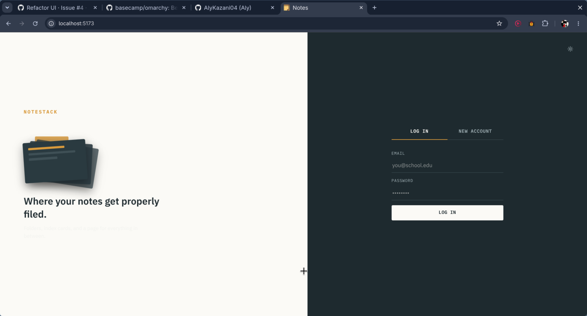
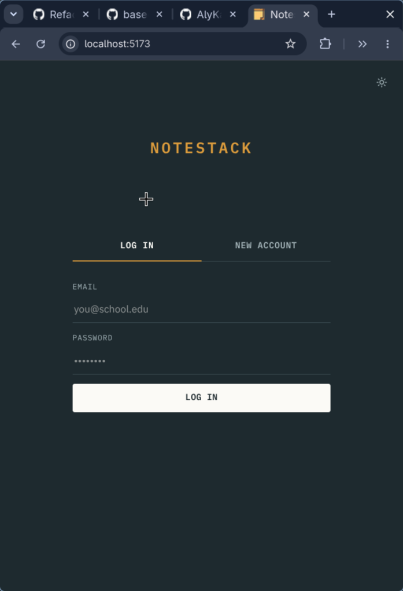
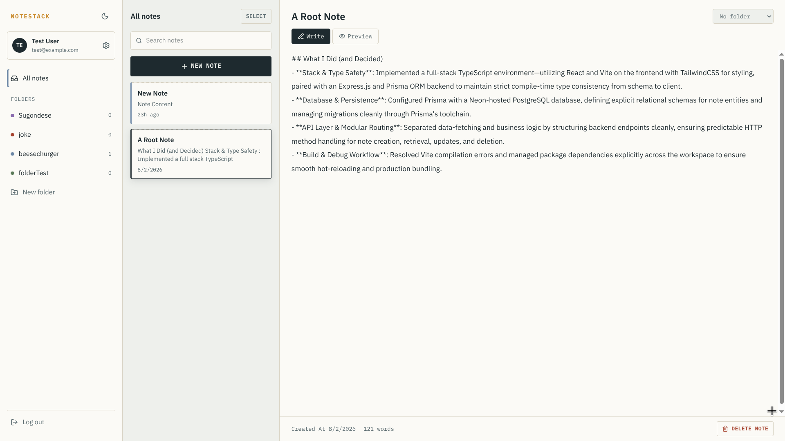
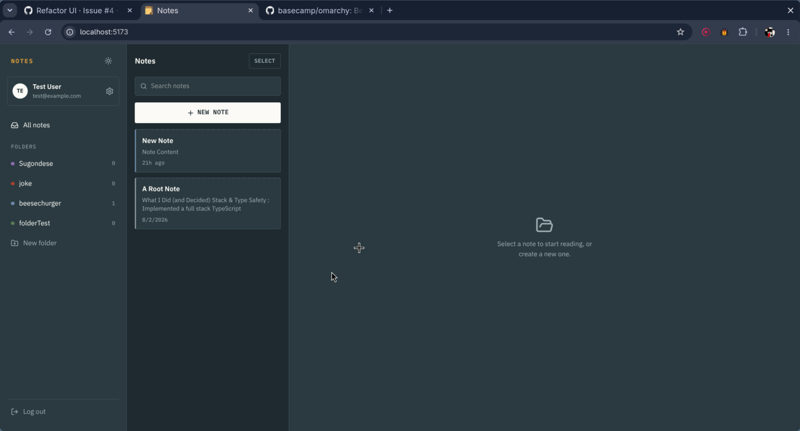
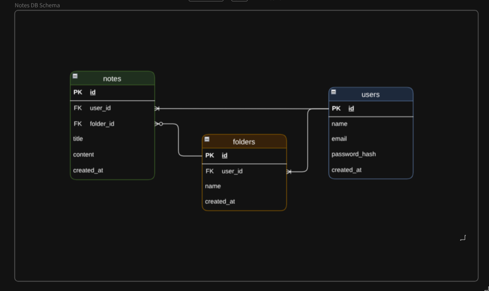

# NoteStack

A modern, secure, and lightning-fast full-stack note-taking application designed for seamless organization. Built with a robust TypeScript backend and a responsive React frontend.

## Demo

### Login / Registration Screen




### Dashboard

#### Light



#### Dark



<details>
  <summary>Schema Explanation</summary>



### 1. `User` Entity (`users`)

- **Core Identity**: Acts as the primary account holder, uniquely identified by an auto-incrementing integer `id` and a unique `email` address with a secure `passwordHash`.

- **Lifecycle Tracking**: Tracks account creation, automatic updates on modification (`updatedAt`), and soft-deletion capability via `deletedAt`.

- **Ownership & Relations**:
  - Owns zero or more `Note` records.
  - Owns zero or more `Folder` records.

- **Cascade Behavior**: If a `User` account is deleted, the database automatically cascades deletion to wipe out all associated `Folder` and `Note` rows.

### 2. `Folder` Entity (`folders`)

- **Core Identity**: Represents a user-defined category or container to group notes, identified by an auto-incrementing `id` and a custom `name`.

- **Composite Ownership Constraint**: Establishes a composite unique key across `[id, userId]`. This advanced design choice allows a `Folder` to securely reference a composite foreign key constraint from notes, ensuring a note can only ever be placed inside a folder that belongs to the exact same user.

- **Performance Indexing**: Maintains an explicit index on `userId` to optimize queries fetching all folders belonging to a specific user.

- **Lifecycle Tracking**: Tracks creation timestamp, automatic modification timestamps, and soft-deletes via `deletedAt`.

- **Relations & Cascade Rules**:
  - Belongs to a single `User` (`onDelete: Cascade` — if the user goes, the folder goes).
  - Contains zero or many `Note` records.

### 3. `Note` Entity (`notes`)

- **Core Identity**: Represents an individual user note containing a `title`, text `content`, and tracking timestamps (`createdAt`, `updatedAt`, and soft-delete `deletedAt`).

- **Optional Organization**: Can exist independently or reside within a specific `Folder` via an optional `folderId`.

- **Performance Indexing**: Features individual indexes on both `userId` and `folderId` to accelerate lookups when filtering notes by owner or folder context.

- **Relations & Safeguards**:
  - Belongs to a single `User` (`onDelete: Cascade`).
  - Optionally links to a `Folder` using a composite relation (`[folderId, userId]` references `[id, userId]`). If the parent folder is deleted, the relation safely unlinks the note (`onDelete: SetNull`) instead of deleting the note itself.

</details>

---

## Tech Stack

### **Frontend**

- **React** with **TypeScript** for type-safe UI components.
- **Vite** for rapid bundling and hot module replacement.
- **TailwindCSS** for modern, responsive styling.

### **Backend**

- **Node.js** & **Express.js** REST API architecture.
- **TypeScript** for strict type checking across controllers and middleware.
- **Zod** for robust runtime schema validation and data sanitization.
- **Prisma ORM** interacting with a **Neon-hosted PostgreSQL** database.
- **Bcrypt** for secure password hashing and JWT-based authentication.

---

## Key Features

- **Secure Authentication**: JWT-based session handling with password hashing and profile management (update name, email, and password).
- **Folder Organization**: Group notes into custom folders with strict user-ownership validation.
- **Advanced Note CRUD**: Create, read, update, and delete individual notes or perform **batch deletions** securely.
- **Contextual Filtering**: Fetch notes dynamically filtered by folder context or view all root notes.
- **Strict Input Validation**: Every incoming request payload and route parameter is rigorously validated using Zod middleware.

### Project Structure / Folder Layout

<details>
  <summary>Click Here</summary>

```Plaintext
notes-fullstack/
├── backend/
│   ├── prisma/
│   │   ├── migrations/          # Prisma database migrations
│   │   └── schema.prisma        # Prisma schema definition
│   ├── src/
│   │   ├── controllers/         # Route handlers (business logic)
│   │   │   ├── authController.ts
│   │   │   ├── folderController.ts
│   │   │   ├── noteController.ts
│   │   │   └── userController.ts
│   │   ├── db/                  # Database access layer
│   │   │   ├── db.ts
│   │   │   ├── folderQueries.ts
│   │   │   ├── noteQueries.ts
│   │   │   ├── schema.ts
│   │   │   └── userQueries.ts
│   │   ├── middleware/          # Express middleware
│   │   │   ├── auth.ts
│   │   │   └── validation.ts
│   │   ├── routes/              # API route definitions
│   │   │   ├── authRoutes.ts
│   │   │   ├── folderRoutes.ts
│   │   │   ├── noteRoutes.ts
│   │   │   └── userRoutes.ts
│   │   ├── schemas/             # Validation schemas
│   │   │   ├── folderSchemas.ts
│   │   │   ├── noteSchemas.ts
│   │   │   └── userSchemas.ts
│   │   ├── utils/               # Helper utilities
│   │   │   ├── jwt.ts
│   │   │   └── passwords.ts
│   │   ├── errorHandler.ts
│   │   ├── index.ts
│   │   └── server.ts
│   ├── .env.example
│   ├── Dockerfile
│   ├── env.ts
│   ├── package.json
│   └── prisma.config.ts
├── frontend/
│   ├── public/
│   │   └── favicon.svg
│   ├── src/
│   │   ├── api/                 # API client & request helpers
│   │   │   ├── auth.ts
│   │   │   ├── client.ts
│   │   │   ├── folders.ts
│   │   │   ├── index.ts
│   │   │   └── notes.ts
│   │   ├── assets/
│   │   ├── components/          # React components
│   │   │   ├── auth/
│   │   │   ├── common/
│   │   │   ├── editor/
│   │   │   ├── noteList/
│   │   │   ├── settings/
│   │   │   └── sidebar/
│   │   ├── hooks/                # Custom React hooks
│   │   │   ├── useAuth.ts
│   │   │   ├── useData.ts
│   │   │   └── useToasts.ts
│   │   ├── types/                # Shared TypeScript types
│   │   │   └── index.ts
│   │   ├── utils/                # Helper utilities
│   │   │   ├── helpers.ts
│   │   │   └── markdown.ts
│   │   ├── App.tsx
│   │   ├── index.css
│   │   └── main.tsx
│   ├── Dockerfile
│   ├── index.html
│   ├── package.json
│   └── vite.config.ts
├── docker-compose.yml
└── README.md
```

</details>

---

## Getting Started

### Prerequisites

Make sure you have the following installed on your machine:

- **Node.js** (v22 or higher)
- **npm** or **yarn**
- A **PostgreSQL** database instance (e.g., Neon)

### 1. Clone the Repository

```bash
git clone https://github.com/AlyKazani04/notes-fullstack.git
cd notes-fullstack
```

### 2. Environment Variables Setup

Create a `.env` file in the both directories from the `.env.example`s and configure the variables.

#### Backend Env

| **Variable**     | **Value**                                                                    |
| :--------------- | :--------------------------------------------------------------------------- |
| `DATABASE_URL`   | `postgresql://YOUR_POSTGRES_DEV_DB_URL_HERE`                                 |
| `PORT`           | `3000 (default, don't reconfigure)`                                          |
| `JWT_SECRET`     | `64_char_long_randomly_generated_string_here (must be longer than 32 chars)` |
| `JWT_EXPIRES_IN` | `3d (default, 7d if not specified)`                                          |
| `BCRYPT_ROUNDS`  | `12 (default, must be between 10-20)`                                        |

#### Frontend Env

| **Variable**    | **Value**                                                                             |
| :-------------- | :------------------------------------------------------------------------------------ |
| `VITE_BASE_URL` | `http://localhost:3000 (default link to the backend server, configure appropriately)` |

### 3. Install Dependencies

```bash
# Install dependencies in each dir separately
npm install
```

### 4. Database Migration

Run Prisma migrations to set up your PostgreSQL schema:

```bash
# in backend/
npx prisma migrate dev --name init
```

### 5. Running the Application

The project is fully containerized using Docker and Docker Compose, managing both the Express backend and Vite frontend services out of the box with live volume mapping for development.

### Docker Compose Architecture

- **`backend`**: Runs on port `3000`, built via `backend/Dockerfile` with automated Prisma client generation.
- **`frontend`**: Runs on port `5173`, built via `frontend/Dockerfile` with Vite configured for polling and external host binding.

### Starting the Stack

#### Spin Up Containers

Build and launch the entire application stack using a clean build to prevent volume dependency conflicts:

```bash
# at project root
docker compose down -v
docker compose build --no-cache
docker compose up
```

Only the frontend development server will be available at `http://localhost:5173`.

For running the backend separately, just run it in the `backend/` dir using `npm run dev`.

---

## 📡 API Endpoints Summary

### **Health Check**

- `GET /health` — To verify that the API is up and running.

### **Auth**

- `POST /api/auth/register` — Create a new user account
- `POST /api/auth/login` — Authenticate and receive a JWT token in the HTTP-only cookie

### **User**

- `GET /api/users/me` — Get the user's Profile Info
- `PATCH /api/users/profile` — Update user name, email, or password
- `POST /api/users/logout` — Log the user out (invalidate the cookie)

### **Folders**

- `GET /api/folders` — Retrieve all folders for the authenticated user
- `POST /api/folders` — Create a new folder
- `PATCH /api/folders/:id` — Rename a specific folder
- `DELETE /api/folders/:id` — Delete a folder

### **Notes**

- `GET /api/notes` — Retrieve notes (supports `?folderId=X` filtering)
- `POST /api/notes` — Create a new note
- `PATCH /api/notes/:id` — Update a note's title, content, or folder placement
- `DELETE /api/notes/:id` — Delete a single note
- `POST /api/notes/batch-delete` — Bulk delete multiple notes securely using an array of IDs
